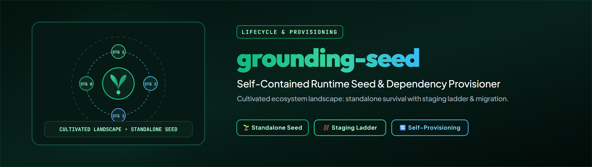

# grounding-seed

[](https://www.python.org/downloads/)
[](LICENSE)
[](https://github.com/ellmos-ai)
[](tests/)

> [!NOTE]
> **AI & LLM Integration Notice**: This repository includes an [`llms.txt`](llms.txt) index file tailored for automated context ingestion, agentic system prompts, and LLM code understanding.

> A seed carries everything it needs to germinate in unknown soil. That's exactly
> what this template is: copied into an isolated module/skill/repo, it makes it
> runnable there -- even WITHOUT our ecosystem.

**Guiding principle: cultivated landscape, not wildflower.** A skill must be able
to survive alone -- that's this template's standalone requirement. But the goal
isn't isolation: where infrastructure exists, modules form a jointly tended bed.
Both at once -- viable alone, more productive together (team-lead's phrasing,
addendum to T-20260815-371628859, 2026-08-15 -- marked as non-binding
inspirational material, adopted here as the tightest statement of the overall
goal so far).

**Relationship to [`source-resolver`](https://github.com/ellmos-ai/source-resolver):**
`source-resolver` answers ONE question: "which component fulfills role X here?" --
it's the resolution engine. `grounding-seed` is the LIFECYCLE around it: recognize
need -> search -> connect -> self-provision if nothing found -> migrate later ->
search again on environment change. **No second resolver:** wherever
`source_resolver` is importable, `grounding-seed` delegates to it fully. Only in
the isolated case does a bundled minimal version of the same staging order run --
provably shape-identical, see `tests/test_ladder_parity.py`.

## Who this is for -- primarily skills, not modules

Measured, not assumed: the 32 bundle manifests declare 94 skills as
`ref: skill:<name>` with `version: registry-current` (alongside 115 modules) --
the module/bundle -> skill relationship is already declared, just at bundle
level, not in the module's own manifest.

**The primary addressee is the skill, not the module.** A module gets
*composed* -- someone decides what belongs together, and the bundle manifest
records it; its environment is therefore largely known in advance. A skill
gets *distributed* -- it lands with whoever, in whatever environment, and has
to find that out at runtime. That's why one side can declare what the other
has to discover.

Two clarifications so this isn't read as "modules never need it":

- A module used **standalone** (no bundle, with an unfamiliar user) is in
  exactly the same position as a skill -- the seed helps it just as much.
  The *common case*, though, is the skill.
- The requirement that follows is **variability**: for a skill, the range of
  possible environments is widest. That's why the staging order has to run
  all the way to "honestly empty" and can't stop at "module not found"
  (team-lead observation, 2026-08-15, doc-only addendum -- no code change).

## Why copying is correct here

The rule of thumb from the connector ticket ("what can silently diverge when
copied is not copied, but called") applies to skills WITHIN our system. For an
isolated repo it's wrong: it can't call what it doesn't have. There, the copy
isn't a mistake but the only option -- the price is paid deliberately and kept
small (see version stamp, "Memory" section).

## The structure IS the plant metaphor, not its illustration

Explicit user request: the ten phases dictate the sections, not just an
introduction. Every phase carries its technical counterpart directly alongside
it; where the metaphor is fuzzy (Light), that's named instead of papered over.

### 1. Self-knowledge -- `self_knowledge.py`

*"What am I, what do I need to be able to do, what do I need for that?"* -- comes
FIRST, before any search. Without a declared need, "searching" is aimless.

Technically: a `Need` list (`rolle`, `kritisch`, `beschreibung`). `assess()`
actually checks each need and returns one of three states -- `found` | `empty`
(asked, nothing there) | `unavailable` (source not queryable). This
three-way split connects directly to T-20260815-205101335: a skill that doesn't
know its own need can't distinguish `empty` from `unavailable` at all.

**`assess()` itself never invents `empty` (fixed in 0.2.0).** `resolve()` only
answers *where* something is, never *what's* there -- "no role could be
located" means "I don't even know where to ask", which is `unavailable`, not
a checked emptiness. So the `resolver` callable passed to `assess()` must
supply the final found/empty/unavailable verdict itself; `empty` can only be
set by a caller that successfully located a role AND then actually read its
content. For the common case of "I only want to know if a role resolves, I'm
not reading content", use `status_from_resolution()` -- it returns
`found`/`unavailable` only, by construction never `empty`.

### 2. Sensing -- no code of its own, just a statement of fact

*"I need senses -- the model that runs the skill."* The skill has no runtime of
its own; it describes WHAT the executing model should look for. That's why the
pattern works as TEXT (template + dependency-free Python library, no daemon or
background process): the model itself is the sense organ, activated by Light
(phase 6).

### 3. Ground/Soil -- `location.py`

The filesystem and environment the module sits in. `detect_ecosystem()` is the
ONLY assumption-free check: is `source_resolver` importable? Everything else
(`hint_root`) is a secondary signal, not a precondition -- an isolated module must
not guess ecosystem paths. "Not found" is a normal, expected state here, not an
error.

### 4. Water -- `store.py`

Ongoing supply: the module's own local storage. **Built forward-compatible
against ONE fixed target schema** (ticket requirement, to be settled before the
build): chosen is `ellmos.source-resolver.user-config.v1` -- the same role schema
as `source-resolver` itself (`SCHEMA_ID` is identical, verified by test). The
other three candidates named in the ticket (USMC schema, Gardener `everything`,
taskplan) are deliberately NOT chosen for this build -- see "What's deliberately
missing".

No global default path like `source-resolver`'s `~/.source-resolver/`: the root
is a required parameter (typically `<module-dir>/.grounding-seed/`) -- an
isolated module assumes nothing about its environment.

### 5. Nutrients + Docking points -- `scan.py`

Two kinds, as the ticket demands: knowledge/preferences (config/rule files:
`AGENTS.md`, `CLAUDE.md`, `.cursor/rules`, ...) and resources/capabilities
(installed programs via `shutil.which`). **Deliberately limited:** no
database/service reachability check -- see "What's deliberately missing".

### 6. Light -- the trigger of a run

Sharpened rather than left vague (the metaphor's original weakest point): Light
is the drive from OUTSIDE that triggers a run in the first place -- a task, a
hook, a scheduled-task cadence. It's exactly what activates Sensing (phase 2):
without Light, the model isn't looking anywhere. That's why `grounding-seed`
needs no daemon -- the "illumination" comes from outside, not from a self-owned
wait state.

### 7. Memory -- arises from searching, not before it

*"Memory, memory change arise from searching."* Important: it's a RESULT, not a
precondition -- the root forms while growing. Technically: `store.py` (a find
becomes stage 0) and the version stamp `template_stamp()`
(`grounding-seed@0.2.0`) carried by every copy, so it can later be determined
which repos carry an old version.

### 8. Transplanting, part 1: cheap detection -- `transplant.py`

*"Search again and again"* needs a frequency limit, or every run scans half the
disk. A full scan as the trigger would be absurd -- `transplant.py` provides only
the CHEAP signal (hostname changed? known paths still valid? interval expired?),
never a scan itself. Only once one of those fires is a new search worthwhile --
idempotent, frequency-limited, guard-protected (per the ~/CLAUDE.md rule for
bulk/background actions).

### 9. Return -- what the module produces that outlasts a run

Data, user preferences, settings -- explicitly OUTLASTING the individual run.
That's `store.py`'s role: every `confirm()` is a return to the module's future,
not just to the current call.

### 10. Transplanting, part 2: the delicate part -- `migration.py`

On a later find: **archive** (not delete), **migrate data**, keep a
**connections-config**. Four minimum requirements, taken verbatim from the
ticket:

1. Archiving means archiving -- the local store stays readable until migration is
   VERIFIED.
2. Migration only counts as complete once the data at the target is DEMONSTRABLY
   complete (count + checksum), not "no error occurred".
3. Failure = back to the local store -- never half here, half there. Technically:
   archiving happens only AFTER successful verification, never before.
4. `connections-config.json` records WHERE and SINCE WHEN.

Tested against temporary directories, including a case that raises NO error but
returns corrupted data (`test_verification_uses_checksum_not_just_error_absence`)
-- requirement 2 taken literally.

## Two operating modes, one skill

```python
from grounding_seed import detect_ecosystem, resolve, LocalStore
from pathlib import Path

store = LocalStore(Path(__file__).parent / ".grounding-seed")
status = detect_ecosystem()  # Ground/Soil

# resolve() delegates to source_resolver itself when available -- a skill doesn't
# need to branch on the operating mode itself, just supply the local store for
# the case where it's needed.
result = resolve("decisions.ledger", store=store)
```

CLI:

```bash
grounding-seed --root ./.grounding-seed status
grounding-seed --root ./.grounding-seed resolve decisions.ledger
grounding-seed --root ./.grounding-seed confirm decisions.ledger '{"pfad": "/own/place"}'
grounding-seed --root ./.grounding-seed scan --program ffmpeg
```

## What's deliberately missing

- **Resource scanning** only covers "program on PATH", not database/service
  reachability -- open-ended, service-specific effort.
- **Migration target adapters:** only the `TargetWriter` interface, NO connection
  to a real target store (USMC/Gardener/taskplan). Tested against a test double,
  not a live store.
- **Foreign providers (stage 3):** deliberately no example provider, same as
  `source-resolver`.
- **Wrapper/pointer self-healing** (existence check for `type: pointer` skills) is
  NOT part of this repo -- `source_resolver.pointer_check` handles that,
  separately motivated by T-20260815-603417673.
- **The `work-autonomous` retrofit** (T-20260815-205101335) is a FOLLOW-UP
  ticket, deliberately after this template, not part of this repo.

## Tests

```bash
python -m pytest tests/ -q
```

45/45 green (as of 2026-08-15), including `test_ladder_parity.py` -- the proof
that the isolated minimal version produces the same result shape as
`source_resolver.ladder` (stage values, status vocabulary, `dialog` structure,
`confirm()` signature).
