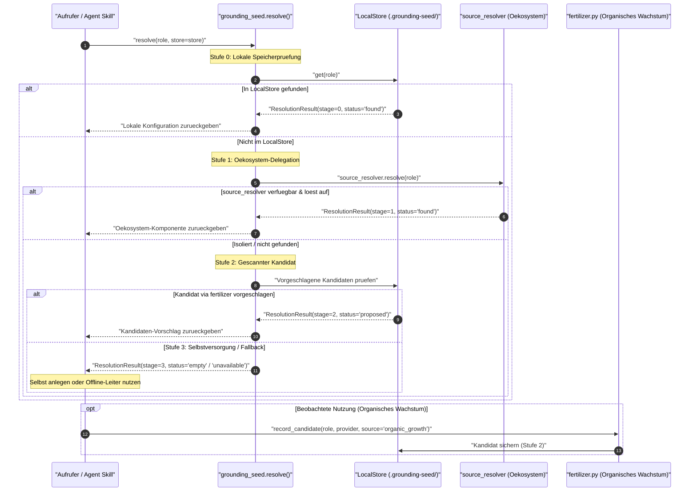
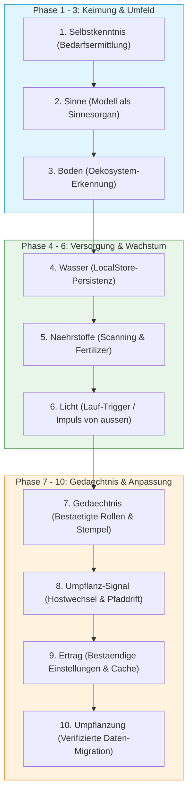

# grounding-seed

[](https://github.com/ellmos-ai/grounding-seed/actions/workflows/ci.yml)
[](https://www.python.org/downloads/)
[](LICENSE)
[](https://github.com/ellmos-ai)
[](https://github.com/open-bricks)
[](SECURITY.md)
[-brightgreen.svg)](#schnellstart)
[](https://github.com/astral-sh/ruff)
[](ellmos-module.v2.json)
[](tests/)

[Schnellstart](#schnellstart) | [Architektur & Diagramme](#visuelle-architektur--sequenzdiagramm) | [Metaphern-Phasen](#die-gliederung-ist-die-pflanzenmetapher-nicht-ihre-illustration) | [Sicherheitsrichtlinie](SECURITY.md) | [Changelog](CHANGELOG.md) | [LLMs-Kontext](llms.txt) | [English Version](README.md)

> [!NOTE]
> **LLM/KI-Kontext-Index:** Eine maschinenlesbare Spezifikation für KI-Agenten befindet sich in [`llms.txt`](llms.txt).

> Ein Samen bringt mit, was er zum Keimen in unbekanntem Boden braucht. Genau das
> ist dieses Template: es wird in ein isoliertes Modul/Skill/Repo kopiert und macht
> es dort -- auch OHNE unser Oekosystem -- lauffaehig.

**Leitbild: Kulturlandschaft statt Wildblume.** Ein Skill muss allein
ueberlebensfaehig sein -- das ist die Standalone-Anforderung dieses Templates.
Aber das Ziel ist nicht Vereinzelung: Wo Infrastruktur da ist, bilden die Module
ein gemeinsam versorgtes Beet. Beides zugleich, allein lebensfaehig und im
Verbund ertragreicher (Team-lead-Formulierung, Nachtrag zu T-20260815-371628859,
2026-08-15 -- als Bildspender gekennzeichnet, hier als knappste Fassung des
Gesamtziels uebernommen).

**Verhaeltnis zu [`source-resolver`](https://github.com/ellmos-ai/source-resolver):**
`source-resolver` beantwortet EINE Frage: "welche Komponente erfuellt hier Rolle X?"
-- die Aufloesungs-Engine. `grounding-seed` ist der LEBENSZYKLUS drumherum: Bedarf
erkennen -> suchen -> verbinden -> selbst anlegen, wenn nichts da -> spaeter
migrieren -> bei Umgebungswechsel neu suchen. **Kein zweiter Resolver:** wo
`source_resolver` importierbar ist, delegiert `grounding-seed` vollstaendig dorthin.
Nur im isolierten Fall laeuft eine mitgebrachte Minimalfassung derselben
Stufenordnung -- nachweislich formgleich, siehe `tests/test_ladder_parity.py`.

## Schnellstart

### 1. Einbindung in ein isoliertes Projekt

Kopiere `src/grounding_seed/` direkt in dein eigenständiges Repository oder Modul:

```bash
cp -r src/grounding_seed/ mein_projekt/vendor/grounding_seed/
```

Oder im Entwicklungsmodus installieren:

```bash
pip install -e .
```

### 2. Python-API (Auflösung & lokaler Speicher)

```python
from pathlib import Path
from grounding_seed import LocalStore, detect_ecosystem, resolve

# 1. Lokalen Seed-Speicher im Modulverzeichnis initialisieren
store = LocalStore(Path(__file__).parent / ".grounding-seed")

# 2. Prüfen, ob ellmos-ai Infrastruktur vorhanden ist
env = detect_ecosystem()
print(f"Ökosystem angebunden: {env.connected}")

# 3. Rolle auflösen: prüft automatisch LocalStore -> source_resolver -> Fallback-Leiter
result = resolve("decisions.ledger", store=store)
print(f"Rollen-Status: {result.status} (Stufe: {result.stage})")

# 4. Lokalen Bereitsteller bestätigen
store.confirm("decisions.ledger", {"pfad": "data/decisions.json"})
```

### 3. Kommandozeilenschnittstelle (CLI)

```bash
# Status und Umgebungsumfeld prüfen
grounding-seed --root ./.grounding-seed status

# Spezifische Rolle auflösen
grounding-seed --root ./.grounding-seed resolve decisions.ledger

# Rollendefinition bestätigen
grounding-seed --root ./.grounding-seed confirm decisions.ledger '{"pfad": "/eigenes/verzeichnis"}'

# PATH nach benötigten Programmen scannen
grounding-seed --root ./.grounding-seed scan --program ffmpeg
```

## Für wen das gedacht ist -- primär für Skills, nicht für Module

Nachgemessen, nicht angenommen: Die 32 Bundle-Manifeste deklarieren 94 Skills
als `ref: skill:<name>` mit `version: registry-current` (neben 115 Modulen) --
die Beziehung Modul/Bundle -> Skill ist also bereits deklariert, nur auf
Bundle-Ebene, nicht im Modul-Manifest selbst.

**Der primäre Adressat ist der Skill, nicht das Modul.** Ein Modul wird
*komponiert* -- jemand entscheidet, was zusammengehört, und das
Bundle-Manifest hält es fest; seine Umgebung ist damit weitgehend bekannt.
Ein Skill wird *verteilt* -- er landet bei irgendwem, in irgendeiner
Umgebung, und muss sie zur Laufzeit herausfinden. Deshalb kann das eine
deklarieren, was das andere erkunden muss.

Zwei Präzisierungen, damit das nicht als „Module brauchen das nie" gelesen
wird:

- Ein **einzeln verwendetes Modul** (ohne Bundle, bei einem fremden Nutzer)
  ist in genau derselben Lage wie ein Skill -- der Seed hilft ihm dann
  ebenso. Der *Regelfall* ist aber der Skill.
- Die Anforderung, die daraus folgt, ist **Variabilität**: Beim Skill ist die
  Bandbreite möglicher Umgebungen am größten. Das ist der Grund, warum die
  Stufenordnung bis zu „ehrlich leer" durchgehen muss und nicht bei „Modul
  nicht gefunden" aufhören darf (Team-lead-Beobachtung, 2026-08-15, reiner
  Dokunachtrag -- keine Code-Änderung).

## Warum kopieren hier richtig ist

Die Faustregel aus dem Connector-Ticket ("was sich beim Kopieren unbemerkt
auseinanderentwickeln kann, wird nicht kopiert, sondern aufgerufen") gilt fuer
Skills INNERHALB unseres Systems. Fuer ein isoliertes Repo ist sie falsch: es kann
nicht aufrufen, was es nicht hat. Dort ist die Kopie kein Fehler, sondern die
einzige Moeglichkeit -- der Preis wird bewusst bezahlt und klein gehalten (siehe Versionsstempel, Abschnitt "Gedaechtnis").

## Visuelle Architektur & Sequenzdiagramm

### Auflösung & Lebenszyklus für organisches Wachstum



### Die 10 Phasen des Pflanzen-Lebenszyklus



## Die Gliederung ist die Pflanzenmetapher, nicht ihre Illustration

Ausdruecklicher Nutzerwunsch: die zehn Phasen geben die Abschnitte vor, nicht nur
eine Einleitung. Jede Phase traegt ihre technische Entsprechung direkt dabei; wo
die Metapher unscharf ist (Licht), wird das benannt statt ueberdeckt.

### 1. Selbstkenntnis -- `self_knowledge.py`

*"Was bin ich, was muss ich koennen, was brauche ich dafuer?"* -- STEHT AM ANFANG,
vor jeder Suche. Ohne deklarierten Bedarf ist "suchen" ziellos.

Technisch: eine `Need`-Liste (`rolle`, `kritisch`, `beschreibung`). `assess()`
prueft jeden Bedarf tatsaechlich und liefert einen von drei Zustaenden --
`found` | `empty` (befragt, nichts da) | `unavailable` (Quelle nicht befragbar).
Diese Dreiteilung ist der direkte Anschluss an T-20260815-205101335: ein Skill,
der seinen Bedarf nicht kennt, kann `empty` und `unavailable` gar nicht
unterscheiden.

**`assess()` erfindet `empty` nie selbst (korrigiert in 0.2.0).** `resolve()`
beantwortet nur WO etwas ist, nie WAS dort drinsteht -- "keine Rolle verortet"
heisst "ich weiss nicht, wohin ich fragen soll", also `unavailable`, kein
geprueftes Leer. Der `resolver`-Callable, der an `assess()` uebergeben wird,
muss deshalb selbst den fertigen found/empty/unavailable-Wert liefern;
`empty` darf nur setzen, wer eine Rolle erfolgreich verortet UND danach den
Inhalt tatsaechlich gelesen hat. Fuer den haeufigen Fall "ich will nur wissen,
ob eine Rolle verortet werden kann, ohne Inhalt zu lesen" gibt es
`status_from_resolution()` -- liefert konstruktionsbedingt nie `empty`.

### 2. Sensorik -- kein eigener Code, sondern eine Feststellung

*"Ich brauche Sensoren -- das Modell, das den Skill betreibt."* Der Skill hat
keine eigene Laufzeit; er beschreibt, WONACH das ausfuehrende Modell schauen soll.
Das erklaert, warum das Muster als TEXT (Template + Python-Bibliothek ohne
Daemon/Hintergrundprozess) funktioniert: das Modell selbst ist das Sinnesorgan,
aktiviert durch Licht (Phase 6).

### 3. Erde/Boden -- `location.py`

Dateisystem und Umgebung, in der das Modul liegt. `detect_ecosystem()` ist der
EINZIGE annahmefreie Check: laesst sich `source_resolver` importieren? Alles
Weitere (`hint_root`) ist Zusatzsignal, nicht Vorbedingung -- ein isoliertes Modul
darf keine Oekosystem-Pfade erraten. "Nicht gefunden" ist hier ein normaler,
erwarteter Zustand, kein Fehler.

### 4. Wasser -- `store.py`

Laufende Versorgung: der eigene, lokale Speicher. **Vorwaertskompatibel gegen EIN
festgelegtes Zielschema** (Ticket-Vorgabe, vor dem Bau zu klaeren): gewaehlt ist
`ellmos.source-resolver.user-config.v1` -- dasselbe Rollen-Schema wie
`source-resolver` selbst (`SCHEMA_ID` ist identisch, per Test verifiziert). Die
drei anderen genannten Kandidaten (USMC-Schema, Gardener `everything`, taskplan)
sind fuer diesen Bau bewusst NICHT gewaehlt -- siehe "Was hier bewusst fehlt".

Kein globaler Default-Pfad wie bei `source-resolver`s `~/.source-resolver/`: die
Wurzel ist Pflichtparameter (typischerweise `<Modulordner>/.grounding-seed/`) --
ein isoliertes Modul nimmt nichts ueber die Umgebung an.

### 5. Naehrstoffe + Andockstellen -- `scan.py`

Zwei Sorten, wie im Ticket verlangt: Wissen/Praeferenzen (Konfig-/Regeldateien:
`AGENTS.md`, `CLAUDE.md`, `.cursor/rules`, ...) und Ressourcen/Faehigkeiten
(installierte Programme via `shutil.which`). **Bewusst begrenzt:** kein
Datenbank-/Dienst-Erreichbarkeitscheck -- siehe "Was hier bewusst fehlt".

**Optionale dritte Quelle -- die Nutzungsspur (`fertilizer.py`, T-20260815-316117714):**
Verbindungen entstehen nicht nur durch Suchen (oben) -- der Nutzer verbindet oft
schon durch die blosse NUTZUNG ("nutze USMC und mach das und das und die
Policies dafuer"). Der eigenstaendige Skill
[`organic-growth@0.1.0`](https://github.com/ellmos-ai/skills/tree/main/skills/infrastructure/organic-growth)
achtet im aktiven Kontextfenster genau darauf -- ruft aber selbst nie
`grounding-seed` oder ein anderes Modul namentlich auf (siehe "Abhaengigkeit
nur in eine Richtung" unten). **Die Bruecke schlaegt der Agent, der beide zur
Verfuegung hat:** Wer nach den Anweisungen von `organic-growth` arbeitet,
bemerkt die Kookkurrenz -- und findet er `grounding-seed`s eigenen
Merkmechanismus vor, traegt er die Spur selbst ueber
`fertilizer.record_candidate()` ein, als Stufe-2-Kandidat
(`Stufe.DISCOVERY_VORSCHLAG`, PROPOSED) -- ein Vorschlag, nie eine automatische
Bindung (konservativer Default, Nutzerentscheid 2026-09-06). **Abhaengigkeit
bewusst nur in EINE Richtung:** `grounding-seed` kennt und empfiehlt
`organic-growth`; `organic-growth` weiss nichts von `grounding-seed` -- er
spricht nur generisch ("wenn ein genanntes Werkzeug einen eigenen
Merkmechanismus hat, nutze ihn") -- und bleibt vollstaendig eigenstaendig
nutzbar. Fehlt der Skill, oder schlaegt kein Agent die Bruecke, faellt diese
dritte Quelle einfach weg -- ohne Fehler, ohne Warnung, nichts, was fehlt und
repariert werden muesste. Nur als Verweis mit
Versionsangabe eingebunden, nie als eingebettete Kopie (der Grundsatz "Warum
Kopieren hier richtig ist" gilt fuer isolierte Repos -- zwei sich
referenzierende ellmos-ai-Skills sind voneinander nicht isoliert).

### 6. Licht -- der Ausloeser eines Laufs

Praezisiert statt schwammig gelassen (der urspruenglich schwaechste Punkt der
Metapher): Licht ist der Antrieb von AUSSEN, der einen Lauf ueberhaupt erst
ausloest -- ein Auftrag, ein Hook, ein Scheduled-Task-Takt. Es ist genau das, was
die Sensorik (Phase 2) aktiviert: ohne Licht schaut das Modell nirgendwo hin.
Deshalb braucht `grounding-seed` keinen Daemon -- die "Beleuchtung" kommt von
aussen, nicht von einem eigenen Wartezustand.

### 7. Gedaechtnis -- entsteht beim Suchen, nicht vorher

*"Bei Suche entsteht: Gedaechtnis, Gedaechtnisaenderung."* Wichtig: es ist
ERGEBNIS, nicht Vorbedingung -- die Wurzel bildet sich beim Wachsen. Technisch:
`store.py` (Fund -> Stufe 0) und der Versionsstempel `template_stamp()`
(`grounding-seed@0.3.2`) in jeder Kopie, damit sich spaeter feststellen laesst,
welche Repos einen alten Stand tragen.

### 8. Verpflanzung, Teil 1: billige Erkennung -- `transplant.py`

*"Immer wieder neu suchen"* braucht eine Frequenzbegrenzung, sonst scannt jeder
Lauf die halbe Platte. Ein voller Scan als Ausloeser waere absurd -- `transplant.py`
liefert nur das GUENSTIGE Signal (Hostname geaendert? bekannte Pfade noch gueltig?
Intervall abgelaufen?), keinen Scan. Erst wenn eines anschlaegt, lohnt sich eine
neue Suche -- idempotent, frequenzbegrenzt, guard-geschuetzt (~/CLAUDE.md-Regel
fuer Bulk-/Hintergrundaktionen).

### 9. Rueckgabe -- was das Modul ueberdauernd produziert

Daten, Userpraeferenzen, Einstellungen -- ausdruecklich UEBER den einzelnen Lauf
hinaus. Das ist `store.py`s Rolle: jede `confirm()`-Bestaetigung ist Rueckgabe an
die Zukunft des Moduls, nicht nur an den aktuellen Aufruf.

### 10. Verpflanzung, Teil 2: der heikle Teil -- `migration.py`

Bei spaeterem Fund: **archivieren** (nicht loeschen), **Daten migrieren**,
**connections-config** fuehren. Vier Mindestanforderungen, woertlich aus dem
Ticket:

1. Archivieren heisst archivieren -- der lokale Bestand bleibt lesbar liegen, bis
   die Migration VERIFIZIERT ist.
2. Migration gilt erst als abgeschlossen, wenn die Daten am Ziel NACHWEISLICH
   vollstaendig sind (Zaehlung + Pruefsumme), nicht "kein Fehler aufgetreten".
3. Fehlschlag = zurueck zum lokalen Bestand -- nie halb hier, halb dort. Technisch
   heisst das: archiviert wird erst NACH erfolgreicher Verifikation, nie vorher.
4. `connections-config.json` haelt WOHIN und SEIT WANN fest.

Getestet gegen temporaere Verzeichnisse, inklusive eines Falls, der KEINEN Fehler
wirft, aber verfaelschte Daten liefert (`test_verification_uses_checksum_not_just_
error_absence`) -- Anforderung 2 woertlich genommen.

## Zwei Betriebsarten, ein Skill

```python
from grounding_seed import detect_ecosystem, resolve, LocalStore
from pathlib import Path

store = LocalStore(Path(__file__).parent / ".grounding-seed")
status = detect_ecosystem()  # Erde/Boden

# resolve() delegiert SELBST an source_resolver, wenn verfuegbar -- ein Skill
# muss die Betriebsart nicht selbst verzweigen, nur den lokalen Store mitgeben
# fuer den Fall, dass sie gebraucht wird.
result = resolve("decisions.ledger", store=store)
```

CLI:

```bash
grounding-seed --root ./.grounding-seed status
grounding-seed --root ./.grounding-seed resolve decisions.ledger
grounding-seed --root ./.grounding-seed confirm decisions.ledger '{"pfad": "/eigener/Ort"}'
grounding-seed --root ./.grounding-seed scan --program ffmpeg
```

## Was hier bewusst fehlt

- **Ressourcen-Scan** deckt nur "Programm auf PATH" ab, nicht Datenbank-/
  Dienst-Erreichbarkeit -- offener, dienstspezifischer Aufwand.
- **Migrations-Zieladapter:** nur die `TargetWriter`-Schnittstelle, KEIN
  Anschluss an einen echten Zielspeicher (USMC/Gardener/taskplan). Getestet gegen
  ein Test-Double, nicht gegen einen lebenden Speicher.
- **Fremdanbieter (Stufe 3):** wie bei `source-resolver` bewusst kein
  Beispiel-Provider.
- **Wrapper-/Pointer-Selbstheilung** (Existenzpruefung fuer `type: pointer`-Skills)
  ist NICHT Teil dieses Repos -- das leistet `source_resolver.pointer_check`,
  separat motiviert durch T-20260815-603417673.
- **`work-autonomous`-Umbau** (T-20260815-205101335) ist ein FOLGETICKET, bewusst
  nach diesem Template, nicht Teil dieses Repos.

## Tests

```bash
python -m pytest tests/ -q
```

72/72 grün (Stand 2026-09-06, mit installiertem source_resolver; ohne das Paket 64/67 plus die 5 test_ladder_parity.py-Tests, die es voraussetzen), inklusive `test_ladder_parity.py` -- dem Beweis,
dass die isolierte Minimalfassung dieselbe Ergebnisform wie `source_resolver.ladder`
produziert (Stufe-Werte, Status-Vokabular, `dialog`-Struktur, `confirm()`-Signatur).
